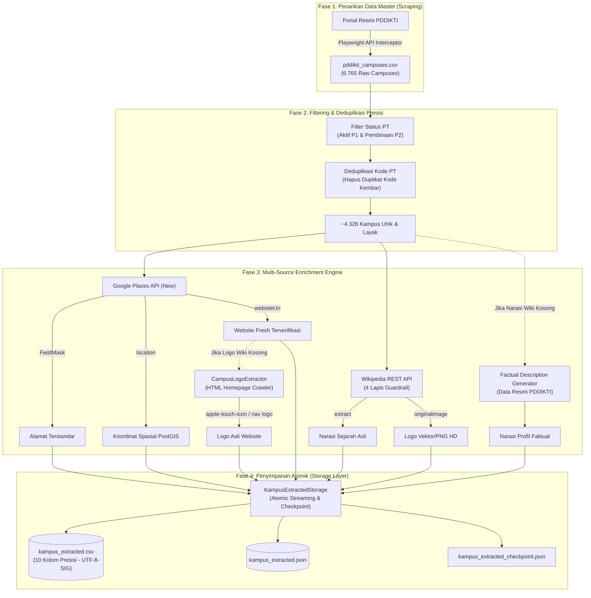

# 🏛️ Arsitektur Sistem & Alur Data (*System Architecture*)

Dokumen ini menjelaskan rancangan arsitektur teknis, pola modul (*design patterns*), struktur direktori, dan strategi resolusi data bertingkat (*multi-tier resolution*) yang digunakan dalam pipeline **Indonesian Campus Data Pipeline**.

---

## 1. Diagram Alur Data (*End-to-End Data Pipeline*)

Pipeline bekerja secara asinkron dan modular, mentransformasi data mentah institusi dari PDDIKTI menjadi dataset terstandarisasi yang diperkaya melalui berbagai sumber eksternal:



---

## 2. Struktur Modul & Tanggung Jawab (*Directory Structure*)

Repositori diorganisasi dengan arsitektur modular yang memisahkan tanggung jawab penarikan data (*scraping*), pengayaan (*enrichment*), validasi (*validation*), dan persistensi (*storage*):

```text
top-hundred-indonesian-campus/
├── data/
│   ├── input/               # Master data CSV & kode referensi wilayah
│   ├── output/              # Berkas luaran CSV, JSON, checkpoint, & laporan audit
│   └── reference/           # Referensi skema HTML/JSON mentah
├── docs/
│   ├── data-structure.md    # Spesifikasi skema basis data resmi Tabel 3.1 KAMPUS
│   ├── data_extraction_process.md # Dokumentasi proses ekstraksi formal proyek
│   ├── SETUP_GUIDE.md       # Panduan instalasi dan setup mesin lokal
│   ├── ARCHITECTURE.md      # Dokumentasi arsitektur sistem (berkas ini)
│   └── CLI_USAGE_GUIDE.md   # Panduan lengkap perintah antarmuka CLI
├── src/
│   ├── extractors/          # Modul ekstraksi data spesifik (Google Maps, Wiki, Web Logo)
│   │   ├── gmaps_enricher.py      # Klien Google Places API (New) & Geocoding
│   │   ├── wikipedia_enricher.py  # Klien Wikipedia REST API + 4 Lapis Guardrail
│   │   ├── logo_extractor.py      # Crawler aset logo dari homepage website kampus
│   │   └── quipper_extractor.py   # Legacy extractor untuk platform Quipper
│   ├── loaders/             # Modul pembaca file input (CSV Loader)
│   ├── models/              # Representasi struktur data (Dataclasses)
│   ├── scrapers/            # Modul automasi browser & API interceptor PDDIKTI
│   │   ├── pddikti_api_scraper.py # Playwright in-browser interceptor
│   │   └── http_scraper.py        # Generic HTTP scraper
│   ├── storage/             # Modul penulisan data ke CSV & JSON
│   │   ├── kampus_extracted_storage.py # Storage streaming 10 kolom presisi
│   │   ├── pddikti_csv_storage.py      # Exporter 23 kolom raw PDDIKTI
│   │   └── pddikti_json_storage.py     # JSON handler untuk data mentah
│   ├── utils/               # Modul pembantu (helper functions)
│   │   ├── factual_description_generator.py # Generator narasi profil resmi
│   │   ├── area_matcher.py        # Pencocok nama wilayah ke master area code
│   │   ├── slug_generator.py      # Pembuat URL slug terstandarisasi
│   │   └── logger.py              # Konfigurasi visual logger terminal & file
│   ├── validators/          # Modul audit integritas dan deduplikasi
│   │   ├── duplicate_auditor.py   # Auditor frekuensi duplikasi nama & kode PT
│   │   └── data_validator.py      # Validator kelengkapan data
│   ├── config.py            # Konfigurasi path direktori global
│   └── main.py              # Entry point CLI orkestrator pipeline utama
├── .env.example             # Template variabel lingkungan
├── requirements.txt         # Daftar pustaka Python yang dibutuhkan
└── README.md                # Dokumentasi utama repositori
```

---

## 3. Strategi Resolusi Data Bertingkat (*Multi-Tier Resolution*)

Untuk memastikan kualitas data setara dengan standar produksi (*production-grade*), pipeline menerapkan strategi resolusi bertingkat (*fallback hierarchy*):

### A. Resolusi Website Resmi (`website_url`)
1. **Aturan Utama:** Mengabaikan kolom website mentah dari PDDIKTI karena tingginya persentase domain mati atau kedaluwarsa.
2. **Prioritas 1 (Google Places API):** Mengambil `websiteUri` yang terverifikasi dan aktif di Google Maps.
3. **Prioritas 2 (Wikipedia Infobox):** Mengambil URL situs resmi dari artikel Wikipedia jika Google Maps tidak memiliki catatan website.
4. **Fallback:** Jika kedua sumber nihil $\rightarrow$ diisi `""` (*NULL*).

### B. Resolusi Logo Institusi (`logo_url`)
1. **Prioritas 1 (Wikimedia Commons):** Mengambil logo berformat vektor PNG transparan atau SVG resolusi tinggi dari artikel Wikipedia yang terverifikasi.
2. **Prioritas 2 (Official Website Crawler):** Jika kampus tidak memiliki halaman Wikipedia, `CampusLogoExtractor` membuka `website_url` resmi dan mencari elemen gambar logo dengan urutan:
   - `<link rel="apple-touch-icon">` (Resolusi tinggi, format kotak).
   - Tag `` pada area header/navbar.
   - Tag Open Graph `<meta property="og:image">`.
   - `<link rel="icon">` / `<link rel="shortcut icon">`.
3. **Fallback:** Jika tidak ditemukan $\rightarrow$ diisi `""` (*NULL*).

### C. Resolusi Narasi Profil & Sejarah (`deskripsi`)
1. **Prioritas 1 (Wikipedia Asli):** Mengambil narasi sejarah dan latar belakang kelembagaan dari artikel Wikipedia yang lolos 4 lapis guardrail.
2. **Prioritas 2 (Factual Description Generator):** Jika tidak ada di Wikipedia, narasi disusun secara otomatis berbasis metadata resmi PDDIKTI (nama entitas, singkatan, jenis PT, pembina LLDIKTI/PTA, akreditasi BAN-PT, status operasional, tahun pendirian, jumlah prodi, dan lokasi kabupaten/provinsi).
3. **Hasil:** **100% dari seluruh 4.326 kampus aktif/pembinaan memiliki deskripsi yang padat, rapi, dan informatif.**

### D. Format Spasial Koordinat (`koordinat`)
* Disimpan dalam standar internasional Open Geospatial Consortium (OGC) untuk PostGIS:
  $$\text{POINT}(\text{longitude } \text{latitude})$$
* Menggunakan referensi koordinat WGS 84 (SRID 4326).
* PostGIS secara otomatis mengenali format teks ini saat operasi `COPY` atau `INSERT` SQL ke kolom bertipe `geography(Point, 4326)`.

---

## 4. Mekanisme Ketahanan & Toleransi Kesalahan (*Fault Tolerance*)

* **Atomic Streaming Write:** Setiap data kampus yang selesai diperkaya langsung ditulis dan di-*flush* ke file `kampus_extracted.csv` dan `kampus_extracted.json`. Jika terjadi pemutusan daya atau crash, data yang telah diproses tidak akan hilang.
* **Checkpoint Tracking:** Progres disimpan dalam `kampus_extracted_checkpoint.json` berisi kumpulan `kode_kampus` yang telah selesai. Eksekusi lanjutan dengan flag `--resume` akan langsung melanjutkan dari kampus berikutnya tanpa memakan kuota API untuk data yang sudah ada.
* **Unverified SSL Context:** Penanganan otomatis untuk website kampus daerah yang memiliki sertifikat SSL kedaluwarsa atau *self-signed certificate*, sehingga crawler tidak mengalami crash saat ekstraksi logo.
